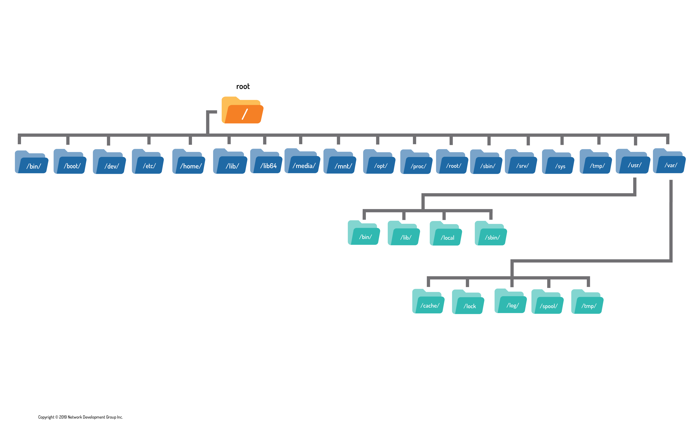

# 13.2 Processes

what is a Processes in the kernal 

* Is an instance of a program in execution 

* This process are provided by the kernal via a pseudo filesystem that is visibile under the /proc directory 

* Hardware devices are available under /dev directory 

* information about those devices can be found in another pseudo filesystem under the /sys directory.

# /proc

Contains information of the current  system hardware and the current kernel configurations 

The /proc directory is read and its information utilized by many different  commands on the system 

different 

# 13.2.1 Process Hierarchy

it starts the init process 

its the first process started by the kernel when a linux or unix based system boots 

it has a process id of one then starts other system processes, and each process is assigned a PID in sequential order.

what is  System V-based system

PID (Process ID): A unique identifier assigned by the kernel to each process running on the system.

The kernel manages each browser process as an independent entity. It allocates memory, CPU time, and other resources to each process according to its scheduling and priority.

# 13.2.2 Viewing Process Snapshot

Another way of viewing processes is with the ps command. By default, the ps command only shows the current processes running in the current shell. Ironically, even though you are trying to obtain information about processes, the ps command includes itself in the output:

If you run ps with the option --forest, then, similar to the pstree command, it shows lines indicating the parent and child relationship:

ps aux
a: Displays processes for all users, not just the current user.
u: Shows the process's user/owner.
x: Lists processes that do not have a controlling terminal (useful for seeing background or daemon processes).

ps -ef
-e or --everyone: Lists all processes running on the system.
-f or --forest: Displays a full-format listing, which includes the parent process ID (PPID), user, and command line.

# 13.2.3 Viewing Processes in Real Time

top command has a dynamic, screen-based interface that regularly updates the output of running processes. The top command is executed as follows:

Load Average:

0.12 0.46 0.25 1/254 3052
The first three numbers in this file indicate the load average over the last one, five and fifteen minute intervals.

Number of Processes:

0.12 0.46 0.25 1/254 3052
The fourth value is a fraction which shows the number of processes currently executing code on the CPU 1 and the total number of processes 254.

Last PID:

0.12 0.46 0.25 1/254 3052
The fifth value is the last PID value that executed code on the CPU.

The number reported as a load average is proportional to the number of CPU cores that are able to execute processes

# 13.3 Memory

the kernal is the manging memory 

memory on the system is shared by all the processes on the system, through a method called virtual addressing

They communicate with the Kernel through “system call” APIs that act as intermediaries between regular programs and the Kernel.

# 13.3.1 Viewing Memory

the swap mempry is the virtual memory 

If the amount of memory and swap that is available becomes very low, then the system will begin to automatically terminate processes, making it critical to monitor the system's memory usage. An administrator that notices the system becoming low on free memory can use top or kill to terminate the processes of their own choice, rather than letting the system choose.

# 13.4 Log Files

As the kernel and various processes run on the system, they produce output that describes how they are running. Some of this output is displayed as standard output and error in the terminal window where the process was executed, though some of this data is not sent to the screen. Instead, it is written to various files. This information is called log data or log messages.

but in more recent distributions, a single service named rsyslogd combines these two functions and more into a single daemon.

In yet more recent distributions, those based on systemd, the logging daemon is named journald

File	Contents
boot.log	Messages generated as services are started during the startup of the system.
cron	Messages generated by the crond daemon for jobs to be executed on a recurring basis.
dmesg	Messages generated by the kernel during system boot up.
maillog	Messages produced by the mail daemon for e-mail messages sent or received.
messages	Messages from the kernel and other processes that don't belong elsewhere. Sometimes named syslog instead of messages after the daemon that writes this file.
secure	Messages from processes that required authorization or authentication (such as the login process).
journal	Messages from the default configuration of the systemd-journald.service; can be configured in the /etc/journald.conf file amongst other places.
Xorg.0.log	Messages from the X Windows (GUI) server.

# 13.5 Kernel Messages

The /var/log/dmesg file contains the kernel messages that were produced during system startup. The /var/log/messages file contains kernel messages that are produced as the system is running, but those messages are mixed in with other messages from daemons or processes.

Although the kernel doesn't have its own log file normally, one can be configured for it by modifying either the /etc/syslog.conf file or the /etc/rsyslog.conf file. In addition, the dmesg command can be used to view the kernel ring buffer, which holds a large number of messages that are generated by the kernel.‌⁠​​⁠​ 

On an active system, or one experiencing many kernel errors, the capacity of this buffer may be exceeded, and some messages might be lost. The size of this buffer is set at the time the kernel is compiled, so it is not trivial to change.

Executing the dmesg command can produce up to 512 kilobytes of text, so filtering the command with a pipe to another command like less or grep is recommended. For example, if a user were troubleshooting problems with a USB device, then searching for the text USB with the grep command is helpful. The -i option is used to ignore c

# 13.6 Filesystem Hierarchy Standard

Among the standards supported by the Linux Foundation is the Filesystem Hierarchy Standard (FHS), which is hosted at the URL http://www.pathname.com/fhs/.

 standard is a set of rules or guidelines that it is recommended to follow. However, these guidelines certainly can be broken, either by entire distributions or by administrators on individual machines.

The FHS standard categorizes each system directory in a couple of ways:

A directory can be categorized as either shareable or not, referring to whether the directory can be shared on a network and used by multiple machines.
The directory is put into a category of having either static files (file contents won't change) or variable files (file contents can change).

# FHS Standard Directory Hierarchy

The FHS standard defines four hierarchies of directories used in organizing the files of the filesystem. The top-level or root hierarchy follows:

| Directory | Contents |
|-----------|----------|
| `/` | The base of the structure, or root of the filesystem, this directory unifies all directories regardless of whether they are local partitions, removable devices, or network shares. |
| `/bin` | Essential binaries like the `ls`, `cp`, and `rm` commands, and be a part of the root filesystem. |
| `/boot` | Files necessary to boot the system, such as the Linux kernel and associated configuration files. |
| `/dev` | Files that represent hardware devices and other special files, such as the `/dev/null` and `/dev/zero` files. |
| `/etc` | Essential host configuration files such as the `/etc/hosts` or `/etc/passwd` files. |
| `/home` | User home directories. |
| `/lib` | Essential libraries to support the executable files in the `/bin` and `/sbin` directories. |
| `/lib64` | Essential libraries built for a specific architecture. For example, the `/lib64` directory for 64-bit AMD/Intel x86 compatible processors. |
| `/media` | Mount point for removable media mounted automatically. |
| `/mnt` | Mount point for temporarily mounting filesystems manually. |
| `/opt` | Optional third-party software installation location. |
| `/proc` | Virtual filesystem for the kernel to report process information, as well as other information. |
| `/root` | Home directory of the root user. |
| `/sbin` | Essential system binaries primarily used by the root user. |
| `/sys` | Virtual filesystem for information about hardware devices connected to the system. |
| `/srv` | Location where site-specific services may be hosted. |
| `/tmp` | Directory where all users are allowed to create temporary files and that is supposed to be cleared at boot time (but often is not). |
| `/usr` | Second hierarchy - Non-essential files for multi-user use. |
| `/usr/local` | Third hierarchy - Files for software not originating from distribution. |
| `/var` | Fourth hierarchy - Files that change over time. |

### Subdirectories of `/var`

| Directory | Contents |
|-----------|----------|
| `/var/cache` | Files used for caching application data. |
| `/var/log` | Most log files. |
| `/var/lock` | Lock files for shared resources. |
| `/var/spool` | Spool files for printing and mail. |
| `/var/tmp` | Temporary files to be preserved between reboots. |

13.6.1 Organization Within the Filesystem Hierarchy

User Home Directories
The /home directory has a directory underneath it for each user account. For example, a user bob will have a home directory of /home/bob. Typically, only the user bob will have access to this directory. Without being assigned special permissions on other directories, a user can only create files in their home directory, the /tmp directory, and the /var/tmp directory.

user specfici binaries 

User-Specific Binaries: Programs that you can run as a regular user.
/bin: Basic programs needed for the system to start.
/usr/bin: More programs that you use every day.
/usr/local/bin: Programs you install yourself (not from the main system).
Other directories like /opt/application/bin and /home/bob/bin are where additional programs or personal programs can be stored.

No, the output you've shown from the `ls /proc` command is not in the form of a table; it's a simple list of directory and file names. However, I can convert the information into a table format for better readability. Here's a table that explains the contents of some of the `/proc` directory entries:

| **Entry**         | **Description**                                                                                   |
|-------------------|---------------------------------------------------------------------------------------------------|
| `1`               | Process with PID 1 (usually `init` or `systemd`, the first process started by the kernel).        |
| `cmdline`         | Command line arguments used to start the current process.                                         |
| `ioports`         | Range of I/O ports used by the system.                                                             |
| `modules`         | List of currently loaded kernel modules.                                                          |
| `sys`             | Information about the kernel's settings and parameters.                                           |
| `consoles`        | Details about available console devices.                                                          |
| `irq`             | Data related to interrupt requests (IRQs) and their counts.                                       |
| `mounts`          | Information about mounted filesystems.                                                           |
| `sysrq-trigger`   | Used to trigger a system request event for debugging or control.                                  |
| `cpuinfo`         | Details about the CPU, such as model, cores, and capabilities.                                   |
| `kallsyms`        | Kernel symbol information (useful for debugging).                                                |
| `mpt`             | Information related to Message Passing Technology (parallel processing).                          |
| `sysvipc`         | Details about System V inter-process communication.                                               |
| `crypto`          | Information related to crypto algorithms supported by the kernel.                                 |
| `kcore`           | Virtual memory representation of the kernel.                                                     |
| `mtrr`            | Memory Type Range Registers, controlling CPU memory caching.                                     |
| `thread-self`     | Link to the current thread's entry in `/proc`.                                                    |
| `devices`         | List of devices currently recognized by the kernel.                                               |
| `key-users`       | Information related to key management for security keys.                                         |
| `net`             | Network interface and configuration details.                                                      |
| `timer_list`      | List of active timers in the kernel.                                                              |
| `diskstats`       | Disk activity statistics.                                                                         |
| `keys`            | Information about the kernel's key management subsystem.                                         |
| `pagetypeinfo`    | Memory page information.                                                                          |
| `tty`             | Terminal device information.                                                                      |
| `dma`             | Details about Direct Memory Access (DMA) channels.                                                |
| `kmsg`            | Kernel log messages.                                                                             |
| `partitions`      | Information about disk partitions.                                                                |
| `uptime`          | The amount of time the system has been running.                                                   |
| `driver`          | Details about loaded kernel drivers.                                                              |
| `kpagecgroup`     | Memory usage statistics for control groups (cgroups).                                             |
| `pressure`        | Memory pressure statistics.                                                                       |
| `version`         | The kernel version.                                                                               |
| `dynamic_debug`   | Settings related to dynamic debugging of kernel modules.                                         |
| `kpagecount`      | Number of references to each memory page.                                                         |
| `schedstat`       | Statistics related to the kernel scheduler.                                                       |
| `version_signature`| Kernel version signature.                                                                        |
| `execdomains`     | Execution domain information for the scheduler.                                                   |
| `kpageflags`      | Flags for memory pages.                                                                           |
| `scsi`            | Information about SCSI devices.                                                                   |
| `vmallocinfo`     | Information on `vmalloc`-managed memory allocations.                                             |
| `acpi`            | Details about the Advanced Configuration and Power Interface (ACPI).                              |
| `fb`              | Information related to the framebuffer device.                                                    |
| `loadavg`         | System load averages over 1, 5, and 15 minutes.                                                   |
| `self`            | A symlink to the current process's entry in `/proc`.                                              |
| `vmstat`          | Virtual memory statistics.                                                                         |
| `bootconfig`      | Configuration settings used at boot.                                                               |
| `filesystems`     | Information about supported filesystems.                                                           |
| `locks`           | File lock information.                                                                             |
| `slabinfo`        | Details about the kernel slab allocator.                                                           |
| `zoneinfo`        | Information about memory zones used by the kernel.                                                 |
| `buddyinfo`       | Statistics related to the buddy allocator for memory management.                                  |
| `fs`              | Filesystem statistics.                                                                            |
| `mdstat`          | Status of software RAID arrays.                                                                   |
| `softirqs`        | Statistics about software interrupt requests (soft IRQs).                                         |
| `bus`             | Information about buses (e.g., PCI, USB).                                                         |
| `interrupts`      | Statistics related to hardware interrupts.                                                        |
| `meminfo`         | Memory usage statistics.                                                                          |
| `stat`            | Overall system statistics (e.g., CPU time, context switches).                                     |

This table should help you understand what each of the `/proc` entries represents in a clearer format.

forground and background 

the amperand start the proccess in the background 

[3] 99 indicates:
[3]: The job number assigned by the shell.
99: The process ID (PID) of the background sleep command.